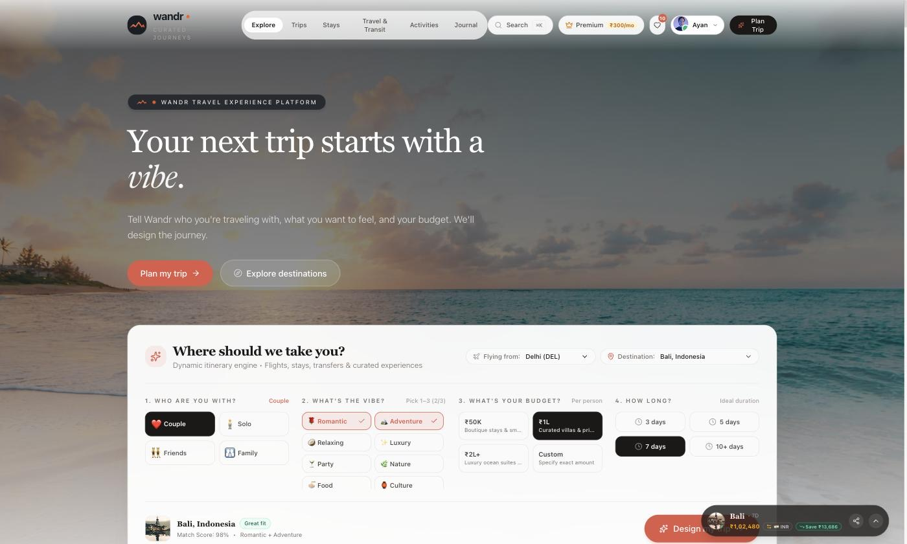
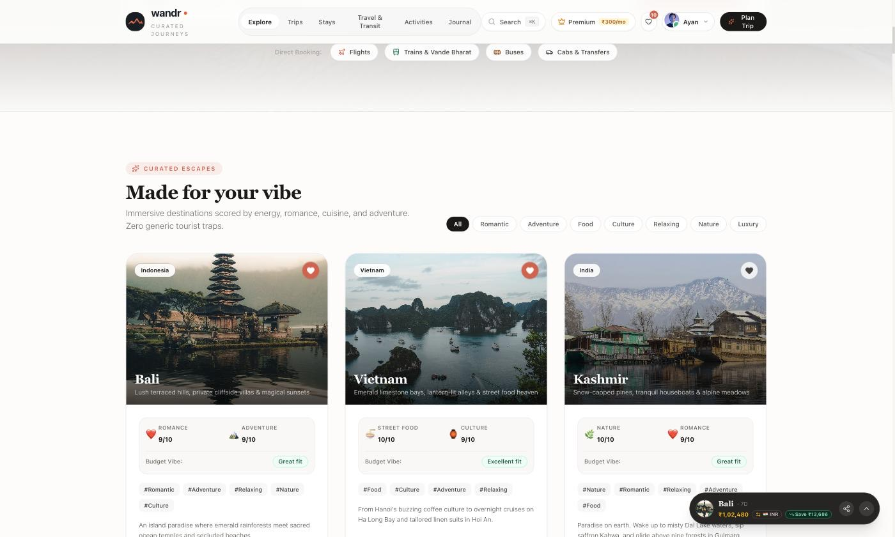

# Wandr

**Don't just book a trip. Design the experience.**

**[Live demo →](https://wandr-tawny.vercel.app)**

Planning a trip today means ten open tabs: destination research, flights, trains, buses,
cabs, hotels, places to visit, activities, restaurants, and finally stitching it all into an
itinerary. Every one of those surfaces optimises for _bookings_. Travellers care about the
_experience_.

Wandr inverts that. You tell it who you're travelling with, what you want the trip to feel
like, your budget and how long you have — and it designs the whole journey: destination,
flights, stay, transfers, day-by-day itinerary and curated experiences, priced against your
budget.



## Status

Early-stage prototype, in active development. The full front end is built and runs against a
curated in-repo dataset — there are no live booking or payment integrations yet, and no
backend. See [Roadmap](#roadmap).

## What it does

**Intent-first planning.** Pick your companion type (solo, couple, friends, family), one to
three vibes out of eight (Romantic, Adventure, Relaxing, Luxury, Party, Nature, Food,
Culture), a budget tier and a duration. The trip planner engine scores destinations against
that combination and assembles a complete trip around the best match.

**Budget-aware synthesis.** Flights, stays, transfers, activities and premium experiences are
selected and costed together against your budget cap, with a full breakdown — subtotal,
taxes, discounts, savings versus budget, and per-person split based on group type.



**One transit hub.** Flights, trains, buses and cabs in a single surface instead of four.

**Trip companion.** Live trip mode, a generated pre-trip checklist that adapts to
destination and duration, weather forecasts, and multi-currency conversion.

**Shareable trips.** A whole plan serialises into a URL, with QR code, WhatsApp / Telegram /
Twitter / email share targets, PDF voucher export and `.ics` calendar export.

## Tech stack

|           |                        |
| --------- | ---------------------- |
| Framework | React 19 + TypeScript  |
| Build     | Vite 6                 |
| Styling   | Tailwind CSS v4        |
| Motion    | Motion (Framer Motion) |
| Icons     | Lucide                 |
| Export    | jsPDF, qrcode          |

No backend — everything runs client-side against a curated dataset in
[`src/data/travelData.ts`](src/data/travelData.ts).

## Getting started

Requires Node 20 or newer.

```bash
git clone https://github.com/byteayan/wandr.git
cd wandr
npm install
npm run dev
```

The app starts on <http://localhost:3000>.

### Scripts

| Script              | What it does                       |
| ------------------- | ---------------------------------- |
| `npm run dev`       | Start the dev server               |
| `npm run build`     | Production build to `dist/`        |
| `npm run preview`   | Serve the production build locally |
| `npm run typecheck` | `tsc --noEmit`                     |
| `npm run lint`      | ESLint                             |
| `npm run format`    | Prettier                           |

## Project structure

```
src/
├── components/   UI — planner, search surfaces, modals, trip views
├── data/         Curated destinations, stays, flights, activities
├── types/        Shared domain types (TripPlan, Destination, UserProfile, …)
└── utils/        Trip planning engine, pricing, exports, sharing, currency
```

The interesting logic lives in `src/utils/`:

- `tripPlannerEngine.ts` — vibe/companion/budget matching and itinerary assembly
- `preTripChecklistEngine.ts` — checklist generation from trip shape
- `shareableTripLink.ts` — trip serialisation into shareable links
- `tripExportService.ts` — PDF voucher and `.ics` calendar generation

## Roadmap

- [ ] LLM-backed intent parsing — plan a trip from a free-text sentence rather than pickers
- [ ] Real inventory via partner booking APIs
- [ ] Backend with accounts and persisted trips
- [ ] Collaborative planning for group trips
- [ ] Deployed demo

## Team

Built by **Binary Bros** — [Ayan Alam](https://github.com/byteayan) and Arshil Khan.

## License

[MIT](LICENSE)
